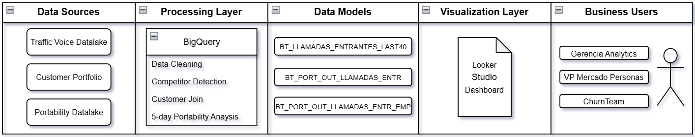
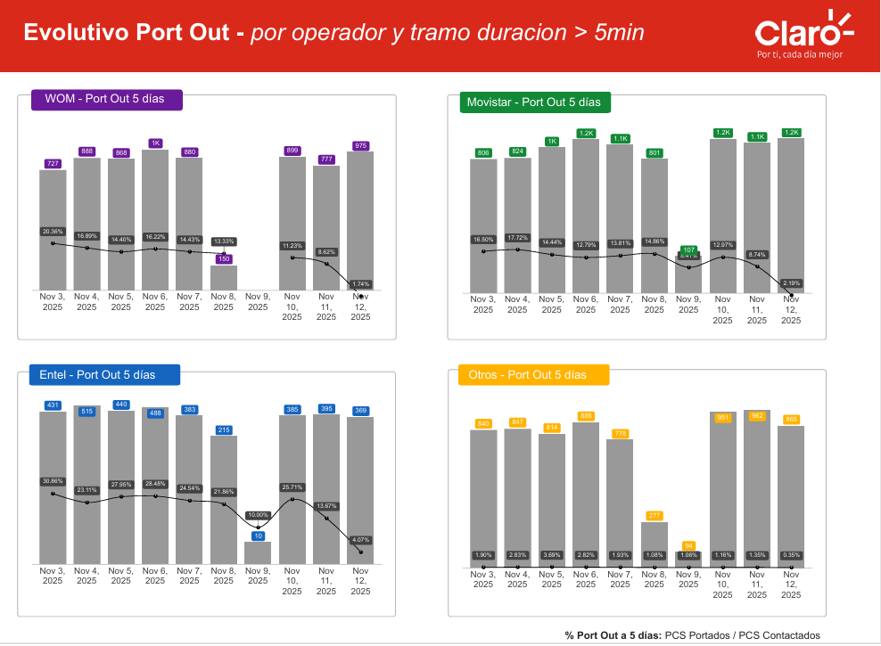
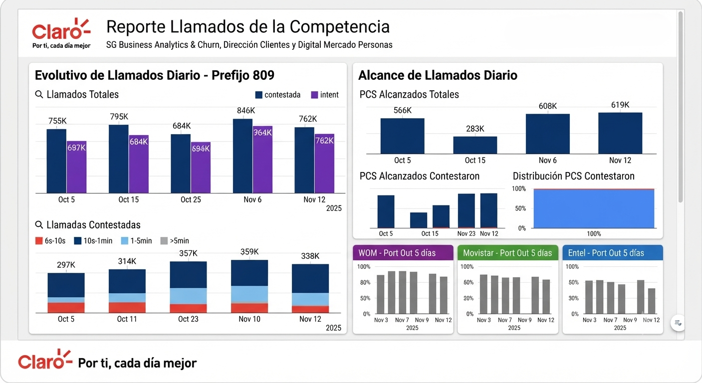

# Competitor Call Detection & Churn Monitoring

Pipeline end-to-end en BigQuery para el monitoreo de llamadas entrantes provenientes de la competencia, análisis de comportamiento de clientes post-contacto y medición de riesgo de portabilidad (churn) en un horizonte de 5 días.

Este proyecto fue desarrollado como parte de procesos de analítica en el área de Churn & Business Analytics, con foco en entregar insights diarios a equipos de gerencia y VP del mercado Personas.

## 📑 Contenido

- 📋 Business Context
- 🎯 Objective of the Project
- 🛠️ Data Pipeline Architecture
- 🧠 Convención de nombres en el diagrama
- 📥 Data Sources
- ⚙️ Data Processing
- 🗄️ Data Models Generated
- 📊 Data Visualization
- 🔄 Automation
- 💡 Business Impact
- 📂 Repository Structure
- 📄 Output / Final Report
- 👾 Tech Stack

## 📋 Business Context

En la industria de telecomunicaciones, la competencia utiliza estrategias de contacto directo a clientes mediante llamadas telefónicas con el objetivo de inducir portabilidad (churn).

Dentro del área de Churn & Retention de Claro Chile, existía la necesidad de monitorear diariamente este comportamiento, identificando cuándo un cliente era contactado por números asociados a competidores y evaluando el impacto de dichos contactos en la probabilidad de portabilidad en los días posteriores.

Antes de este desarrollo, no existía un sistema automatizado que permitiera:

- Identificar llamadas entrantes provenientes de operadores competidores
- Relacionar estas interacciones con la cartera de clientes vigente
- Medir el impacto de estas llamadas en la portabilidad dentro de una ventana de 5 días

## 🎯 Objective of the Project

El objetivo de este proyecto es diseñar y automatizar un pipeline de datos en BigQuery que permita identificar, procesar y analizar llamadas entrantes provenientes de operadores competidores, vinculándolas con la cartera de clientes de la compañía.

A partir de esta integración de datos, el sistema permite:

- Detectar clientes contactados por la competencia de forma diaria
- Enriquecer la información de llamadas con datos de cartera (RUT, segmento, estado del cliente)
- Medir el comportamiento de portabilidad dentro de una ventana de 5 días posteriores al contacto
- Analizar el impacto temporal de estas llamadas en la probabilidad de portabilidad
- Segmentar los resultados por duración de llamada y operador de origen
- Generar reportes diarios automatizados para equipos de gestión y alta dirección

## 🛠️ Data Pipeline Architecture

El sistema fue construido sobre Google Cloud Platform utilizando BigQuery como motor principal de procesamiento de datos.

<p align="center">
  
</p>

El pipeline integra múltiples fuentes de datos de la compañía y del ecosistema de telecomunicaciones, permitiendo la construcción de un flujo automatizado de análisis de llamadas y portabilidad.

## 🧠 Convención de nombres en el diagrama

Para mejorar la legibilidad visual del diagrama de arquitectura, se utilizaron nombres simplificados para las tablas.

Estos nombres corresponden directamente a las tablas reales implementadas en BigQuery:

| Nombre en diagrama | Tabla real en BigQuery |
|--------------------|------------------------|
| BT_LLAMADAS_ENTRANTES_LAST40 | BT_LLAMADAS_ENTRANTES_ULT40_DIAS_V4 |
| BT_PORT_OUT_LLAMADAS_ENTR | BT_PORT_OUT_LLAMADAS_ENTR_V4 |
| BT_PORT_OUT_LLAMADAS_ENTR_EMP | BT_PORT_OUT_LLAMADAS_ENTR_EMPRESAS_V4 |

Esta simplificación se realizó únicamente con fines visuales, sin afectar la estructura ni lógica del pipeline de datos.

### 📥 1. Data Sources

- **Traffic Voice Data (Datalake de llamadas entrantes):**
  Contiene el registro de llamadas telefónicas, incluyendo número origen, número destino, duración y fecha del evento.

- **Customer Portfolio (Cartera de clientes postpago):**
  Base de datos de clientes activos, con información como RUT, estado del cliente y segmento.

- **Industry Portability Dataset:**
  Registro de portabilidad de la industria, utilizado para identificar cambios de operador en el tiempo.

### ⚙️ 2. Data Processing (BigQuery)

Se implementaron procesos de transformación mediante SQL en BigQuery:

- Limpieza y normalización de números telefónicos
- Identificación de llamadas provenientes de operadores competidores mediante prefijos
- Clasificación de llamadas por duración y segmentación de comportamiento
- Enriquecimiento con datos de cartera de clientes
- Eliminación de duplicados mediante window functions
- Cruce con datos de portabilidad en una ventana de 5 días

### 🗄️ 3. Data Models Generated

El pipeline genera tres tablas principales:

- **BT_LLAMADAS_ENTRANTES_LAST40:**
  Dataset base con llamadas entrantes enriquecidas con información de clientes.

- **BT_PORT_OUT_LLAMADAS_ENTR:**
  Métricas agregadas de portabilidad dentro de 5 días post contacto.

- **BT_PORT_OUT_LLAMADAS_ENTR_EMP:**
  Análisis segmentado por operador de origen y duración de llamada.

### 📊 4. Data Visualization

Los datos procesados son consumidos por dashboards en Looker Studio, los cuales permiten:

- Monitoreo diario de llamadas de competencia
- Seguimiento de tasas de portabilidad
- Segmentación por operador y duración de llamada
- Visualización ejecutiva para gerencia y VP

### 🔄 5. Automation

El pipeline se ejecuta de forma diaria mediante consultas programadas en BigQuery, asegurando la actualización constante de los indicadores utilizados por el negocio.

## 💡 Business Impact

El pipeline permitió identificar un patrón consistente de comportamiento post-contacto con la competencia, donde llamadas de mayor duración (>5 min) presentan una probabilidad significativamente mayor de port-out dentro de 5 días.

Este insight habilitó la identificación de un segmento de clientes de alto riesgo, permitiendo priorización de acciones de retención como campañas de recontacto y estrategias de contraoferta.

Adicionalmente, el sistema permitió monitoreo diario del riesgo de churn, mejorando la capacidad de respuesta del área de Churn & Retention frente a actividad competitiva.

<p align="center">
  
</p>


## 📂 Repository Structure

```text
├── assets/
│   └── diagrams/
│       └── architecture.png
│
├── outputs/
│   └── reporte_llamados.pdf
│
├── sql/
│   ├── 01_base_call_enrichment.sql
│   ├── 02_churn_5day_metrics.sql
│   └── 03_churn_segmentation_analysis.sql
│
└── README.md
```

## 📊 Output / Final Report

El pipeline genera un reporte final en formato PDF con los principales resultados del análisis de llamadas de la competencia y su relación con churn.

Además, se incluye una vista previa del dashboard utilizado para consumo ejecutivo:

<p align="center">
  
</p>

📄 Descargar reporte:
👉 **[Ver reporte generado](outputs/reporte_llamados.pdf)**

## 👾 Tech Stack

- Google Cloud Platform (GCP)
- BigQuery
- SQL (Window Functions, CTEs, Joins)
- Looker Studio
- Data Pipelines / Scheduled Queries
